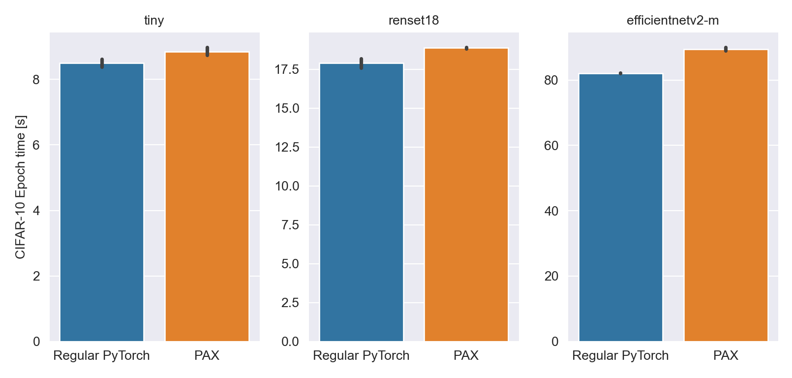

<p></p>

Sharing some of JAX's beautiful API with PyTorch users.

Disambiguation: for wardrobes, see [link](https://www.ikea.com/ch/en/cat/pax-system-19086/). For peace, you are at the right spot.


## Installation
```bash
pip install paxlib
```

or 
```bash
pip install git+https://github.com/epfml/pax.git
```

## Pytrees in PyTorch

```python
import torch
import pax

tree = {
    "a": [torch.tensor(3.0), torch.tensor(4.0)],
    "c": 4
}
pax.tree_map(lambda x: x*2, tree)
```

Note: we currently depend on `jax` for this functionality, but we could use [dm-tree](https://github.com/deepmind/tree) instead to drop the dependency.

## Autodiff that looks like JAX

We follow the API of `jax.grad`: 
```python
import pax

f = lambda x: x**2
df_dx = pax.grad(f)
df_dx(2.0)  # tensor(4.0)
```

This works with any Pytree as input:

```python
def f(x):
    return x["a"] * x["b"]

x = {"a": 2.0, "b": -1.5}
pax.value_and_grad(f)(x)  # (tensor(-3.), {'a': tensor(-1.5000), 'b': tensor(2.)})
```

PAX also supports higher-order derivatives:
```python
f = lambda x: 1/6 * x**3
pax.grad(f)(2.0)  # tensor(2.)
pax.grad(pax.grad(f))(3.0) # tensor(3.)
```

## Example: Minimal SGD

```python
import torch
import pax

f = lambda x: x**2
df_dx = pax.grad(f)

x = torch.randn([])  # initialization
for step in range(20):
    x = x - 0.1 * df_dx(x)
    print(x, f(x))
```

## Example: meta-learning the learning rate

```python
f = lambda x: x**2
df_dx = pax.grad(f)

def sgd(x, lr=0.1, num_steps=10):
    for _ in range(num_steps):
        x = x - lr * df_dx(x)
    return x

# optimize the learning rate
def meta_loss(lr):
    x0 = 1.0
    return f(sgd(x0, lr=lr))

df_dlr = pax.grad(meta_loss)

lr = 0.1
for _ in range(100):
    lr = lr - 0.1 * df_dlr(lr)
```

## Converting from PyTorch

We provide a small wrapper for PyTorch _modules_ to make them behave like [Haiku](https://github.com/deepmind/dm-haiku).
```python
net = torch.nn.Linear(10, 1)  # any torch.nn.Module

# convert
forward = pax.functional_module(net)

# intialize
params, buffers = pax.get_params(net), pax.get_buffers(net)

# run
data_batch = torch.zeros(2, 10)
out, buffers = forward(params, data_batch, buffers=buffers, is_training=True)
```

and also a wrapper to make PyTorch _optimizers_ functional like [Optax](https://github.com/deepmind/optax):

```python
optimizer = pax.functional_optimizer(torch.optim.Adam, lr=1e-3)

f = lambda x: x**2
df_dx = pax.grad(f)
params = torch.tensor(3.)
opt_state = optimizer.init(params)

for step in range(10):
    params, opt_state = optimizer.step(params, df_dx(params), opt_state)
    print(params.item())
```

Using PAX optimizers with learning rate schedulers looks like this:
```python
optimizer = pax.functional_optimizer(torch.optim.SGD, lr=0)
lr_at_step = pax.functional_schedule(torch.optim.lr_scheduler.LambdaLR, lr_lambda=lambda step: 1/(step+1), initial_lr=0.1)

f = lambda x: x**2
df_dx = pax.grad(f)
params = torch.tensor(3.)
opt_state = optimizer.init(params)

for step in range(10):
    params, opt_state = optimizer.step(params, df_dx(params), opt_state, lr=lr_at_step(step))
    print(params.item())
```

## Runtime overhead

We measured the time required for one epoch on CIFAR-10 with a batch size of 128.
We compare a standard PyTorch implementation based on [this tutorial](https://pytorch.org/tutorials/beginner/blitz/cifar10_tutorial.html) to a PAX one, using `pax.value_and_grad`, `pax.functional_module` and `pax.functional_optimizer`. This is currently a little slower than regular PyTorch code. The peak memory usage could be larger too.


